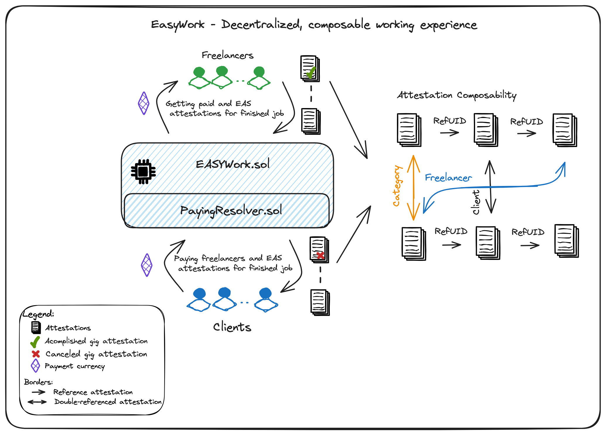

# Revolutionizing Freelance Collaboration: Trust, Transparency, and the Power of EAS

Welcome to a new era of freelancing where trust is not just earned but seamlessly woven into the fabric of every collaboration. Today, we're thrilled to introduce **EasyWork**, a decentralized freelance platform that harnesses the Ethereum Attestation Protocol (EAS) to redefine how freelancers and clients connect and collaborate.

P.S. Find the links to deployed contracts, frontend/backend repo at the end.

## The Trust Challenge:

In the vast world of online collaborations, establishing trust has always been a hurdle. How can you be sure that the skills on a freelancer's profile are genuine, or that a client is reliable? EasyWork tackles this head-on with EAS-powered attestations.

## EAS: Crafting Trust with Digital Signatures:

At the core of EasyWork is the Ethereum Attestation Protocol, a powerful tool that uses digital signatures to create a cryptographically signed stamp of approval. These attestations serve as verifiable claims about a freelancer's skills, work history, and identity.

## Why Attestations Matter:

In a digital landscape, trust often falters in the absence of face-to-face interaction. Attestations provide a solution by offering third-party validation and a secure, immutably recorded confirmation of the authenticity of information.

## Informed Hiring Decisions:

Imagine a platform where clients can make hiring decisions with confidence. EasyWork utilizes on-chain attestations to create transparent and verifiable work histories for freelancers. Clients can now base their decisions on a detailed, validated record of a freelancer's achievements.

## Flexible Credential Ownership:

Freelancers on EasyWork own and control their credentials through EAS attestations. This not only ensures a secure way to present qualifications but also allows for flexible sharing, empowering freelancers to tailor their credentials to each client's needs.

## Decentralized Identity for Freelancers:

In a world where personal data is often at risk, EAS contributes to the development of decentralized, self-sovereign identity systems. Freelancers gain control over their information, enhancing privacy and security.

## Reducing Fraud and Ensuring Security:

Attestations are not just about building trust; they're also about creating a secure environment. By verifying the identities of freelancers and clients, EasyWork significantly reduces the risk of fraudulent activities.

## Composable Reputation Building:

In the freelance world, reputation is everything. EAS's composability enables freelancers to build their reputation dynamically. Each successful project and positive feedback become interconnected attestations, reflecting a freelancer's evolving reputation.

## Efficient Professional Certifications:

Professional certifications become composable attestations on EasyWork, showcasing freelancers' expertise in a modular and referenceable system. This streamlines the verification process, making it efficient for both freelancers and clients.

## Seamless Network of Trust:

At the heart of EasyWork is a composable trust network. Freelancers and clients can create attestations about their interactions, fostering a network where trust is not just earned but also actively built upon.

## Blockchain-Based Reputation:

The reputation system on EasyWork is not static; it's dynamic and blockchain-based. Each job and positive interaction form interconnected attestations, ensuring reputations evolve based on ongoing performance.

## Future-Proofing Through Modular Data Structures:

As freelance trends evolve, EasyWork stands ready. EAS's modular approach ensures the platform remains agile and adaptable, ready to embrace future enhancements and meet the changing needs of freelancers and clients.

EasyWork is not just a freelance platform; it's a transformative force, leveraging EAS to provide transparency, trust, and a decentralized approach to collaboration. Join us in redefining how freelancers and clients interact in the digital economy! 🌐✨

# Contracts 

## Linea 
PayingResolver.sol https://explorer.goerli.linea.build/address/0x45B1cc693B7B1090C4411B2d024B41d12fa89973

EasyWork.sol
https://explorer.goerli.linea.build/address/0x84f470944EA413C4419AD624B10a62E5bE4785Ac

## Arbitrum
PayingResolver.sol 
https://goerli.arbiscan.io/address/0x64817795cF38eFfBD799B70Fa6C8c833f4F6b0bF

EasyWork.sol
https://goerli.arbiscan.io/address/0x8793DC5D2Af8460EeC76Fca8547F710ac66954db
